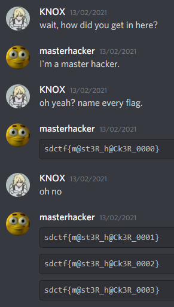
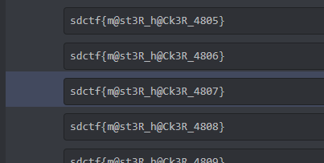

## hide and seek 2

I've gotten some more good intel. Apparently, the following information is the location of another flag!

First piece of info

gg/4KcDWnUYMs

Second piece of info

810237829564727312-810359639975526490

---------------------------------

### First part of the flag

    gg/4KcDWnUYMs

Looks like a discord link :

    discord.gg/4KcDWnUYMs

brings us to a secret server with 10k flags

from `sdctf{m@st3R_h@Ck3R_000}` to `sdctf{m@st3R_h@Ck3R_9999}`

Then we're supposed to get the right flag with the help of the second part

### Second part of the flag :

    810359639975526490-810237829564727312

One can notice that it looks like a message id if you have been playing around discord developer tools.

So I took the first part : `810359639975526490`

Grabbed the link of a message in the "admin" server : `discord.com/channels/810237829564727308/810237829564727312/810359742227546133`

Replaced the id part with the second part of the hint `discord.com/channels/810237829564727308/810237829564727312/810359639975526490`

Brought us to the right number for the flag : `sdctf{m@st3R_h@Ck3R_4807}`
